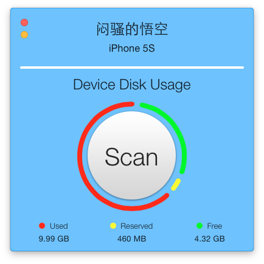
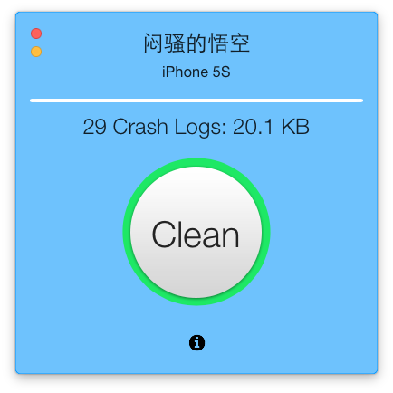
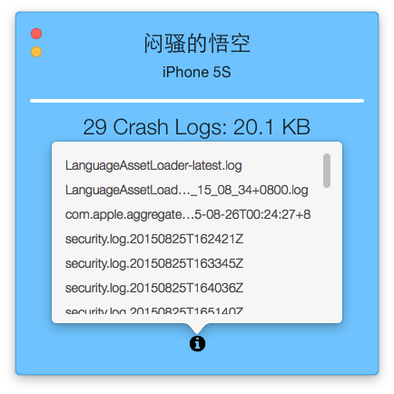
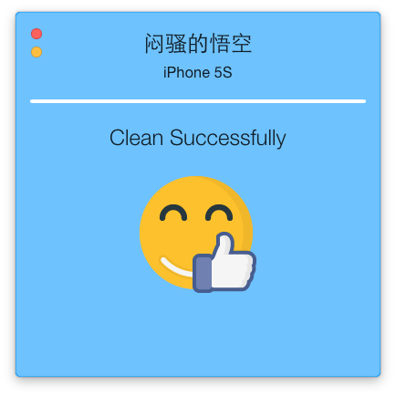

## iPhone &amp; iPad Cleaner ##

Use SDMMobileDevice.framework instead of Apple's private framework MobileDevice.framework.
So it can be Sandboxed App for AppStore ^_^

Currently just clean crash log. (Apple has imposed more restrictions, we can not access installed app dir now.)
As a guy with obsessive-compulsive disorder, I still feel lucky to be able to clean my iPhones' crash log --!

Where is the crash log?

Settings -> Privacy -> Diagnostics & Usage -> Diagnostics & Usage Data

[Do you have or care about the same problem ?](https://v2ex.com/t/188500)

With MyMobileCleaner, now it is not a problem.

The world is clear now ^_^
